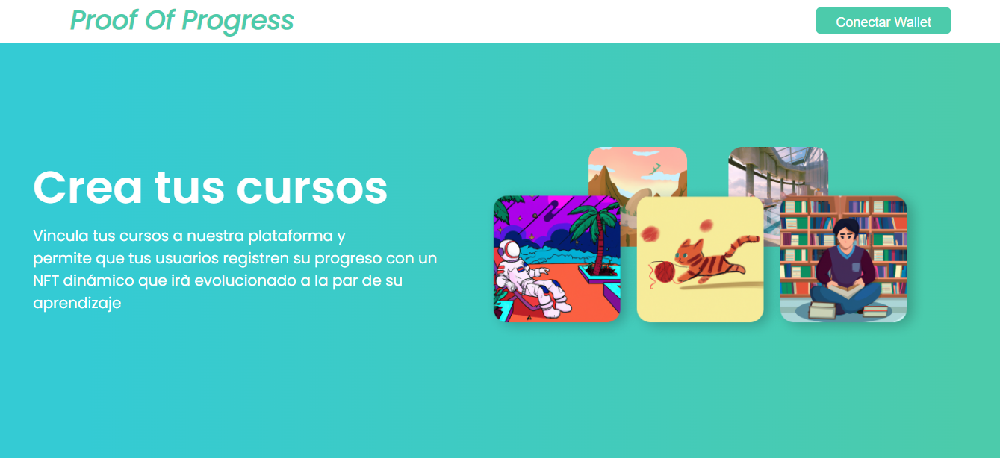
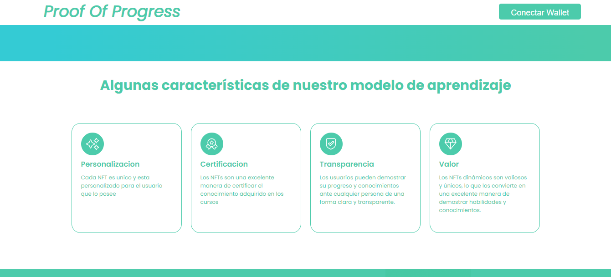
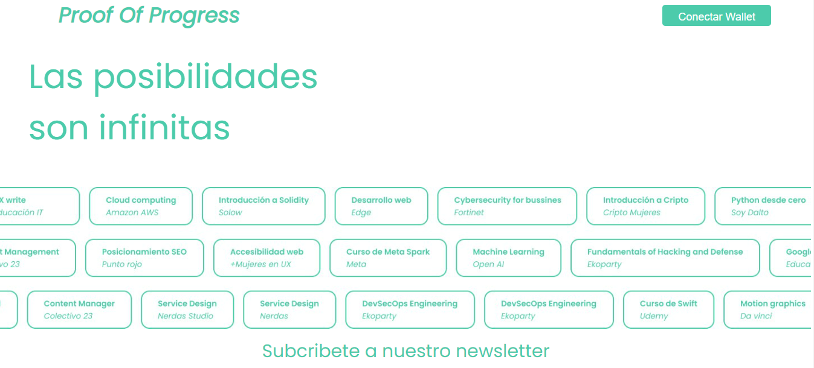
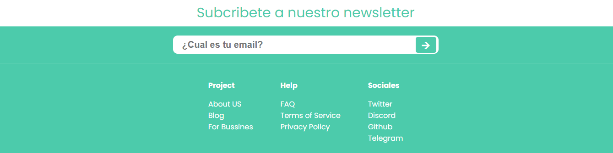

## DOCUMENTACION Proof Of Progress (POP)

### DESCRIPCION DEL PROYECTO

Proof of progress es un proyecto basado en NFTs dinamicos que se van modificando a medida que el estudiante progresa en su camino de aprendizaje. Nuestro servidor aloja las evaluaciones de la plataforma educativa y el estudiante, al inscibirse en un curso, mintea automaticamente un NFT que servira para trackear su progreso durante el mismo. Cada hito en el camino educativo dispara una modificacion de la imagen del NFT, permitiendo reflejar en tiempo real los conocimientos que va adquiriendo el estudiante.

### Requisitos para utilizar el proyecto

- Metamask instalado como extension - [metamask](https://chrome.google.com/webstore/detail/metamask/nkbihfbeogaeaoehlefnkodbefgpgknn?hl=es)
- Red de Polygon Mumbai - [configuracion](https://www.datawallet.com/crypto/add-polygon-mumbai-to-metamask)

### Requisiton para correr el proyecto

- Version Node superio a la 16.0

Realizar los siguientes comandos:

- `yarn` o `npm install`
- `yarn dev` o `npm run dev`

### Datos del Equipo

1. [Jose Garcia] - (jose23122009@gmail)
2. [Franklyn ccahuana rojas] - (frank7rojas@gmail.com)
3. [Nicolas Limomoff] - (nicolas.limonoff@gmail)
4. [Rodrigo Díaz Perera] - (diazperera@gmail.com)
5. [Guadalupe Quezada] -(soyguadalupequezadagmail.com)

### CEDALIO SETUP

La configuracion de la base de datos de CEDALIO, se realizo para bases de datos individuales por usuario. Es decir, cada usuario que se conecta por primera vez, deploya una base de datos con sus datos a la red de Polygon Mumbai

## HOOKS

### useWallet

Hook encargado de la logica de conectar y desconectar la wallet a traves de metamask. Una vez conectado te devuele los siguientes valores

```typescript
const { handleConnect, shortAddress, address, isLoading, isConnected } =
  useWallet();
```

- handleConnect: Maneja el connect y disconnect
- shortAddress: La wallet address resumida; 0x43...0000
- address: La wallet address completa
- isLoading: Un estado que dice si esta conectando o desconectando activo
- isConnected: Un Boolean

### useLocalStorage

Hook encargado de almacenar un valor para que permanezca aunque reinicies la pagina web. Se le asigna una key y un valor inicial

Ejemplo de uso:

```typescript
function MyComponent() {
  const [count, setCount] = useLocalStorage<number>('count', 0);

  const handleClick = () => {
    setCount(count + 1);
  };

  return (
    <div>
      <p>Count: {count}</p>
      <button onClick={handleClick}>Increment</button>
    </div>
  );
}
```

### useCedalio

Hook que maneja el deploy utilizando el servidor de cedalio para crear una base de datos unica para cada usuario.

**Por falta de tiempo, no logramos terminar de integrar la base de datos, nos falto el createUser ya definido el schema e invocar la informacion. Por falta de tiempo se uso el localStorage.**

## COSAS QUE NOS FALTARON

- Invocar la data almacenada en la base de datos de Cedalio
- Animaciones mas fluidas
- Loaders y eventos
- El NFT no tiene requerimientos, es decir que no importa el puntaja, se termina de updatear y la idea era que cumpla.
- NFT del avatar
- La vista de Reclutador
- Espacio de Cursos Patrocinados

## IMAGENES






